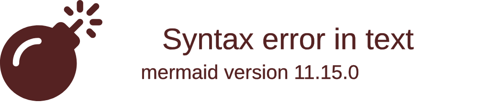

# web
A repository where we learn and design webpages 

```mermaid
%%{init: { 'theme': 'default', 'git': { 'spacing': 50 } } }%%
gitGraph:
  options:
    nodeSpacing: 100
  branches:
    main:
      - 'Commit 1'
      - 'Commit 2'
    feature:
      - 'Commit 3'
      - 'Commit 4'
      - 'Commit 5'
```
